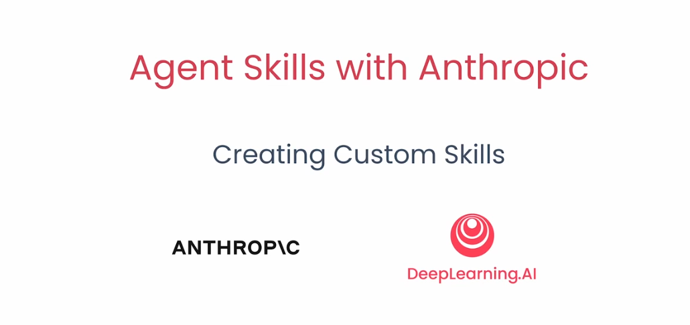
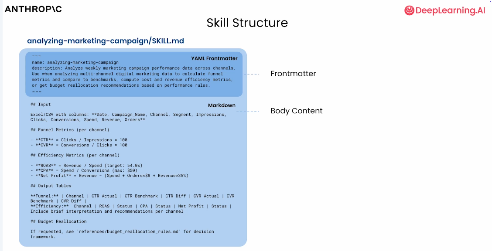
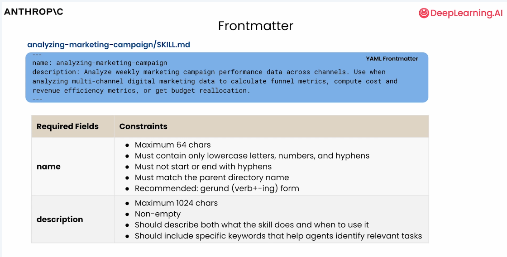

# 第六节：Creating Custom Skills（自定义Skills）

---
本节将深入剖析 Skill 的组成结构，并手把手演示如何从零构建高质量 Skill。随后，我们将通过两个实战示例——“基于讲义自动生成练习题”与“时间序列数据特征分析”——将所学知识付诸实践。

回顾一下，我们创建的每个技能都有一个必需的 SKILL.md 文件，其中包含需要名称和描述的 YAML 前置元数据。在底层的 SKILL.md 中，我们有技能的内容，以及对脚本或任何附加文本文件、必需资源的引用，这些资源只有在需要时才会加载。

比如下图：

